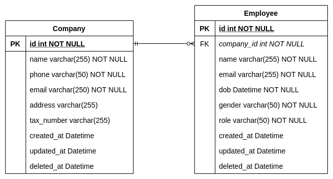

# Let's GO Company

## What to do
In this service, you will develop a backend server side functions that handle the **company** and **employee** API
resources.This service will contain 2 sub-services which are the Rest and gRPC service.
Rest service will handle the http requests while gRPC will handle the rpc request to the API resources.

The company and employee ERD can be referred below:


## Expected Output
* Build `go-company-service` image and bring up the services in `docker-compose.yml`.
* Execute database migration and seeding.
* Expose company API resources endpoint which includes:
    * Create a company.
    * Get a company by an id.
    * Update a company by an id.
    * Delete a company by an id.
    * list a company by page and limit.
* Expose employee API resources endpoint which includes:
    * Create an employee for a specific company.
    * Get an employee by an id.
    * Update an employee by an id.
    * Delete an employee by an id.
    * list employee by company id, page and limit.
* Calculate the current total employee of a company.

## Sample JSON response:
### Company
```
{
    "id": "string",
    "name": "string",
    "phone": "string",
    "email": "string",
    "address": "string",
    "tax_number": "string",
    "total_employee": 0,
    "created_at": "string",
    "updated_at": "string"
}
```
### Employee
```
{
    "id": "string",
    "company_id": "string",
    "name": "string",
    "email": "string",
    "dob": "string",
    "gender": "string", // allowed values: "male", "female", "not_specified"
    "role": "string", // allowed values: "manager", "staff", "intern""
    "created_at": "string",
    "updated_at": "string"
}
```

> NOTE: DO NOT commit changes directly into the master branch. Make your own master branch.